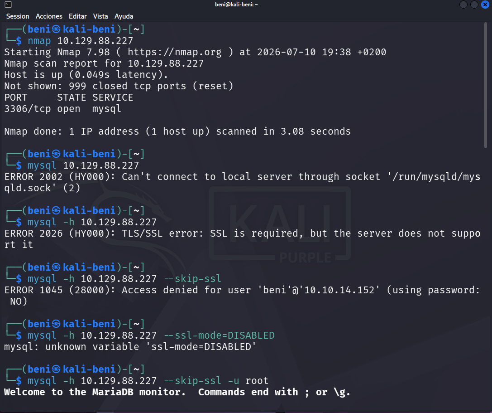
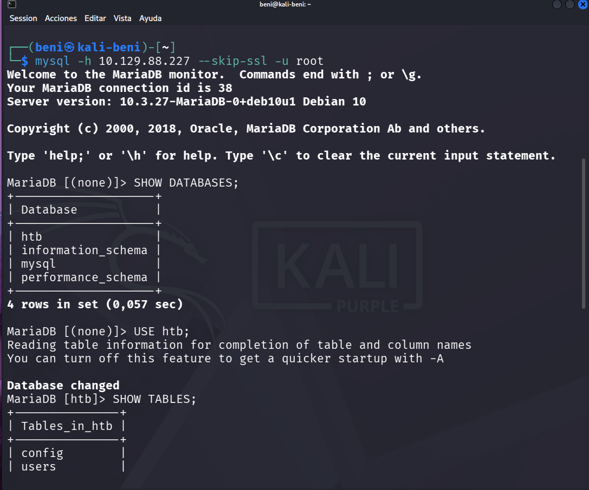
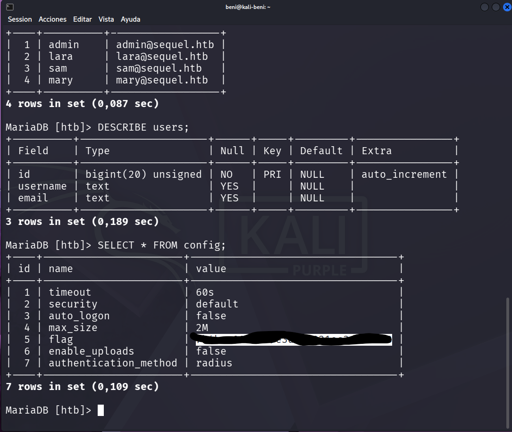

# 🗄️ Sequel

> **Plataforma:** Hack The Box  
> **Categoría:** Starting Point  
> **Dificultad:** Very Easy  
> **Sistema Operativo:** Linux  
> **Servicio principal:** MySQL / MariaDB

> **⚠️ Nota:** Este repositorio documenta mi proceso de aprendizaje en Hack The Box. El objetivo es registrar los conceptos aprendidos, las herramientas utilizadas y la metodología seguida durante cada laboratorio.

---

# 📖 Descripción

En este laboratorio se aprende a identificar un servicio **MySQL** expuesto, conectarse de forma remota y realizar tareas básicas de enumeración sobre una base de datos utilizando el cliente `mysql`.

---

# 🎯 Objetivo

- Identificar el servicio disponible.
- Conectarse al servidor MySQL.
- Enumerar las bases de datos disponibles.
- Explorar las tablas existentes.
- Obtener la flag del laboratorio.

---

# 🌐 Reconocimiento

El primer paso consistió en identificar los servicios expuestos mediante un escaneo con **Nmap**.

```bash
nmap 10.129.88.227
```

El resultado mostró:

- Host activo.
- Puerto **3306/tcp** abierto.
- Servicio **MySQL**.

**📸 Evidencia**



---

# 🚪 Acceso

Tras identificar el puerto **3306 (MySQL)** abierto, el primer intento de conexión fue:

```bash
mysql 10.129.88.227
```

**Resultado**

❌ Error al intentar conectarse mediante el socket local de MySQL.

**¿Por qué ocurre?**

Al no utilizar el parámetro `-h`, el cliente `mysql` interpreta que queremos conectarnos a una base de datos instalada en nuestro propio equipo (Kali Linux), en lugar de hacerlo al servidor remoto del laboratorio.

Para indicar que la conexión debía realizarse a un servidor remoto se añadió el parámetro `-h`.

```bash
mysql -h 10.129.88.227
```

**Resultado**

❌ El servidor devolvió un error relacionado con SSL indicando que el cliente intentaba establecer una conexión cifrada, pero el servidor no soportaba SSL.

**¿Por qué ocurre?**

Algunas versiones del cliente MySQL intentan utilizar SSL automáticamente. En este laboratorio el servidor no admite conexiones SSL, por lo que fue necesario desactivar esta opción.

Se añadió entonces el parámetro:

```bash
--skip-ssl
```

Quedando el comando de la siguiente forma:

```bash
mysql -h 10.129.88.227 --skip-ssl
```

**Resultado**

❌ Acceso denegado porque no se había especificado ningún usuario.

**¿Por qué ocurre?**

Cuando no se indica un usuario, el cliente intenta autenticarse utilizando el nombre del usuario del sistema operativo (en este caso `beni`), pero dicho usuario no existe en la base de datos del laboratorio.

Finalmente se añadió el usuario **root**.

### ✅ Comando final utilizado

```bash
mysql -h 10.129.88.227 --skip-ssl -u root
```

Con este comando se consiguió acceder correctamente al servidor MariaDB.

**📸 Evidencia**



---

# 🔎 Enumeración

Una vez obtenida la conexión con el servidor MariaDB, el siguiente paso fue descubrir qué bases de datos estaban disponibles.

Para ello se utilizó el siguiente comando:

```sql
SHOW DATABASES;
```

**¿Qué hace este comando?**

Muestra todas las bases de datos existentes a las que el usuario tiene acceso.

En este laboratorio aparecieron las siguientes:

- htb
- information_schema
- mysql
- performance_schema

Como la base de datos relacionada con el laboratorio era **htb**, se seleccionó mediante:

```sql
USE htb;
```

**¿Qué hace este comando?**

Indica que todos los comandos SQL que ejecutemos a partir de ese momento se realizarán sobre la base de datos **htb**.

El siguiente paso consistió en descubrir qué tablas contenía.

```sql
SHOW TABLES;
```

**Resultado**

Se localizaron dos tablas:

- config
- users

**📸 Evidencia**



---

# 📊 Extracción de información

Una vez identificadas las tablas disponibles, el siguiente paso fue analizar su contenido para descubrir qué información almacenaban.

Se comenzó consultando la tabla **users**.

```sql
SELECT * FROM users;
```

**¿Qué hace este comando?**

La instrucción `SELECT *` muestra **todos los registros y todas las columnas** de una tabla.

**Resultado**

Se obtuvieron varios usuarios junto con sus direcciones de correo electrónico, confirmando que la tabla almacenaba información de los usuarios de la aplicación.

Para conocer la estructura de esta tabla se utilizó:

```sql
DESCRIBE users;
```

**¿Qué hace este comando?**

Muestra la estructura de una tabla, indicando:

- Nombre de cada columna.
- Tipo de dato.
- Si puede contener valores NULL.
- Clave primaria.
- Información adicional.

Gracias a este comando fue posible comprender cómo estaba organizada la información antes de continuar con la enumeración.

A continuación se analizó la tabla **config**.

```sql
SELECT * FROM config;
```

**¿Qué hace este comando?**

Muestra todo el contenido almacenado en la tabla **config**.

**Resultado**

Entre los diferentes parámetros de configuración apareció un registro llamado **flag**, donde se encontraba la flag del laboratorio.

**📸 Evidencia**


---

# 🏁 Resultado

Tras completar la enumeración de la base de datos fue posible localizar la información solicitada por el laboratorio.

La tabla **config** almacenaba diferentes parámetros de configuración de la aplicación y, entre ellos, un registro denominado **flag**, que contenía la flag necesaria para completar el ejercicio.

Con ello se dio por finalizado el laboratorio con éxito, habiendo conseguido:

- Identificar un servicio MySQL expuesto.
- Conectarse de forma remota al servidor MariaDB.
- Enumerar las bases de datos disponibles.
- Acceder a la base de datos del laboratorio.
- Enumerar las tablas existentes.
- Consultar el contenido de las tablas.
- Localizar la flag del laboratorio.

Este laboratorio permitió practicar el proceso básico de enumeración sobre una base de datos MySQL/MariaDB, una tarea muy habitual durante auditorías de seguridad y pruebas de penetración.

---

# 🛠️ Herramientas utilizadas

Durante la resolución de este laboratorio se utilizaron las siguientes herramientas:

### Nmap

Se utilizó para realizar el reconocimiento inicial del objetivo e identificar los puertos y servicios expuestos.

### Cliente MySQL (mysql)

Herramienta de línea de comandos utilizada para establecer la conexión con el servidor MariaDB y ejecutar consultas SQL.

### MariaDB

Sistema de gestión de bases de datos presente en el laboratorio sobre el que se realizaron todas las tareas de enumeración.

### Kali Linux

Sistema operativo utilizado como máquina atacante para ejecutar las herramientas y realizar el laboratorio.

---

# 📚 Conceptos aprendidos

Durante este laboratorio se reforzaron los siguientes conceptos:

- Cómo identificar un servicio MySQL/MariaDB mediante un escaneo con Nmap.
- Diferencia entre conectarse a una base de datos local y a una base de datos remota utilizando el parámetro `-h`.
- Cómo resolver errores de conexión relacionados con SSL utilizando el parámetro `--skip-ssl`.
- Importancia de especificar el usuario correcto al autenticarse en un servidor MySQL.
- Cómo enumerar las bases de datos disponibles mediante `SHOW DATABASES;`.
- Cómo seleccionar una base de datos utilizando `USE`.
- Cómo descubrir las tablas existentes mediante `SHOW TABLES;`.
- Cómo consultar el contenido de una tabla utilizando `SELECT *`.
- Cómo analizar la estructura de una tabla mediante `DESCRIBE`.
- Comprender el flujo básico de enumeración de una base de datos durante una prueba de penetración.

  ---

# 📑 Resumen de comandos utilizados

A continuación se muestra el proceso completo seguido durante la resolución del laboratorio.

## 1. Reconocimiento del objetivo

Lo primero fue identificar qué servicios estaban expuestos en la máquina.

```bash
nmap 10.129.88.227
```

El escaneo reveló que el puerto **3306** estaba abierto y que el servicio correspondía a **MySQL/MariaDB**.

---

## 2. Primer intento de conexión

Una vez identificado el servicio, se intentó conectar utilizando el cliente MySQL.

```bash
mysql 10.129.88.227
```

Este intento no funcionó porque el cliente interpretó que debía conectarse a una base de datos local mediante un socket de MySQL.

---

## 3. Conexión al servidor remoto

Para indicar que la conexión debía realizarse contra un servidor remoto se añadió el parámetro `-h`.

```bash
mysql -h 10.129.88.227
```

En esta ocasión el servidor respondió con un error relacionado con SSL.

---

## 4. Desactivar SSL

Como el servidor del laboratorio no soportaba conexiones SSL, fue necesario añadir el parámetro `--skip-ssl`.

```bash
mysql -h 10.129.88.227 --skip-ssl
```

El cliente consiguió avanzar un paso más, pero el acceso fue rechazado porque todavía no se había especificado un usuario.

---

## 5. Acceso al servidor

Finalmente se indicó el usuario **root**, obteniendo acceso correctamente al servidor MariaDB.

```bash
mysql -h 10.129.88.227 --skip-ssl -u root
```

---

## 6. Enumeración de bases de datos

Una vez dentro del servidor, se listaron todas las bases de datos disponibles.

```sql
SHOW DATABASES;
```

---

## 7. Selección de la base de datos

Como el laboratorio utilizaba la base de datos **htb**, se seleccionó para trabajar sobre ella.

```sql
USE htb;
```

---

## 8. Enumeración de tablas

Se consultaron las tablas existentes dentro de la base de datos.

```sql
SHOW TABLES;
```

---

## 9. Análisis de la tabla de usuarios

Se visualizaron todos los registros almacenados en la tabla **users**.

```sql
SELECT * FROM users;
```

Posteriormente se consultó su estructura.

```sql
DESCRIBE users;
```

---

## 10. Obtención de la flag

Por último se consultó la tabla **config**, donde se encontraba almacenada la flag del laboratorio.

```sql
SELECT * FROM config;
```
---

# 💭 Reflexión personal

Este laboratorio me permitió comprender el proceso básico de enumeración sobre un servidor MySQL/MariaDB desde el punto de vista de un atacante.

Aunque el objetivo final era obtener una flag, lo más importante fue entender el razonamiento que hay detrás de cada paso: primero identificar el servicio, después establecer una conexión válida y, finalmente, enumerar la información disponible hasta localizar el dato buscado.

Uno de los aspectos más interesantes fue comprobar cómo pequeños detalles, como utilizar el parámetro `-h`, desactivar SSL con `--skip-ssl` o indicar correctamente el usuario, pueden marcar la diferencia entre no poder acceder al servicio o conseguir una conexión válida.

Este laboratorio también me ayudó a familiarizarme con algunos de los comandos SQL más utilizados durante una fase de enumeración, como `SHOW DATABASES`, `SHOW TABLES`, `SELECT` y `DESCRIBE`, comprendiendo para qué sirve cada uno y cuándo utilizarlos.

Cada laboratorio que completo me ayuda a reforzar mi metodología de trabajo y a ganar confianza utilizando herramientas y comandos que forman parte del día a día en el ámbito de la ciberseguridad.
---

# 🎯 ¿Qué me llevo para futuros laboratorios?

- Identificar primero el servicio antes de intentar interactuar con él.
- Analizar los errores de conexión, ya que suelen indicar cómo resolver el problema.
- Seguir una metodología ordenada: descubrir el servicio, acceder, enumerar y, por último, buscar la información de interés.
- Recordar que comprender el propósito de cada comando es más importante que memorizar su sintaxis.
