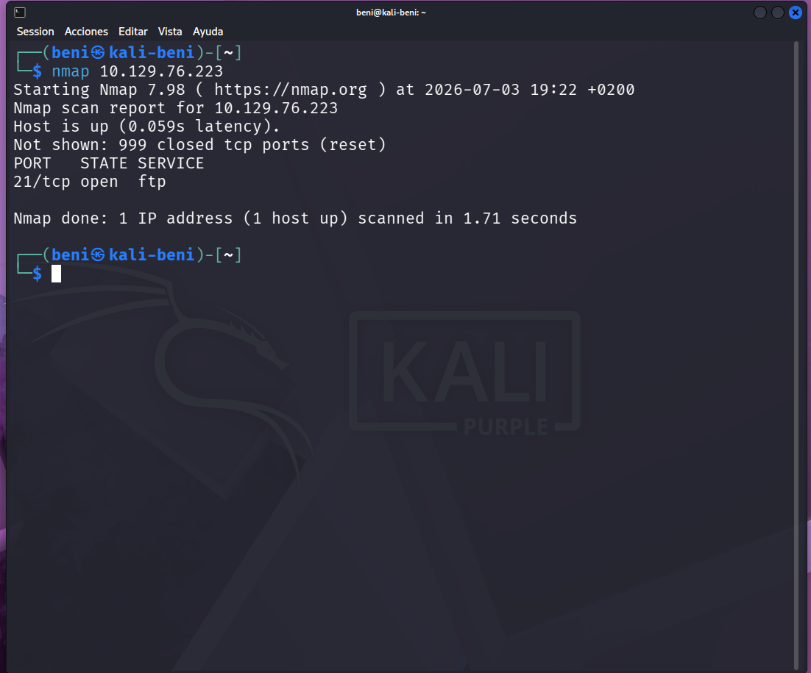

# 🦌 Fawn

## 📋 Información

- **Plataforma:** Hack The Box
- **Categoría:** Starting Point
- **Dificultad:** Muy fácil
- **Sistema operativo:** Linux

---

## 🎯 Objetivo

El objetivo de este laboratorio era identificar el servicio expuesto, acceder al servidor FTP mediante acceso anónimo y obtener la flag almacenada en el servidor.

---

## 🛠️ Herramientas utilizadas

- Nmap
- FTP
- OpenVPN
- Kali Linux

---

## 🔍 Pasos realizados

### 1. Conexión a la VPN

Se estableció la conexión con la VPN de Hack The Box mediante OpenVPN.

### 2. Escaneo con Nmap

Se realizó un escaneo para identificar los servicios disponibles.

```bash
nmap <IP>
```

Resultado:

- Puerto **21/tcp** abierto.
- Servicio **FTP (vsFTPd 3.0.3)**.


### 3. Acceso mediante FTP

Se realizó la conexión utilizando el usuario anónimo.

```bash
ftp <IP>
```

Usuario:

```text
anonymous
```

Contraseña:

```text
(Enter)
```

### 4. Enumeración

Se listaron los archivos disponibles.

```bash
ls
```

Se encontró el archivo:

```text
flag.txt
```

### 5. Descarga de la flag

```bash
get flag.txt
```

### 6. Visualización

```bash
cat flag.txt
```

---

## 📚 Conceptos aprendidos

- Qué es FTP.
- Qué es el acceso anónimo.
- Uso básico de Nmap.
- Uso del cliente FTP.
- Descarga de archivos mediante FTP.
- Diferencia entre OpenVPN y FTP.

---

## ✅ Resultado

Laboratorio completado correctamente obteniendo la flag del servidor.
